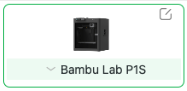
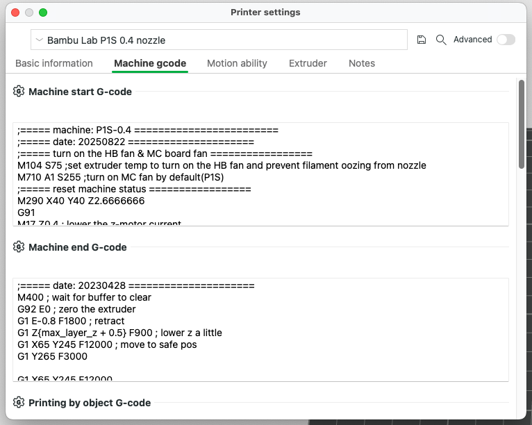
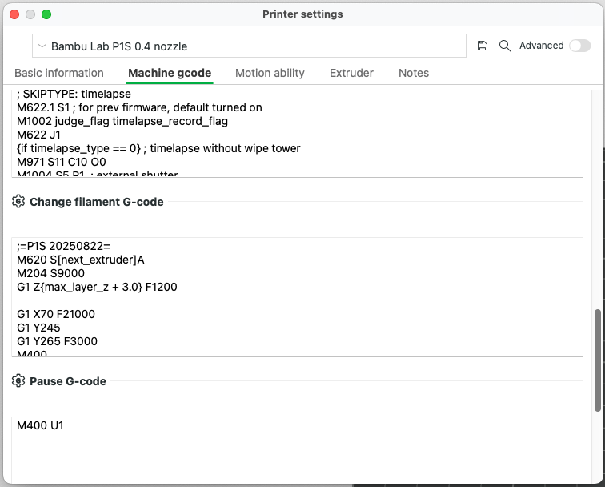

# bqwipe
BQ Nozzle Brush Wipe Code - Enhanced Cleaning Mod for Bambu Lab X1/P1 Series Printers  
  
This project improves the cleaning performance of the BQ Nozzle Brush by adding extra slow-speed wipes above the brush, increasing friction against the rubber for a more thorough clean. It also helps reduce purge chute clogs by introducing additional movement of the flushing lever.  
  
==== WARNING ====  
Editing G-code on your Bambu Lab printer carries risk. 
Proceed at your own discretion — I’m not responsible for any damage caused.  
  
### Installation Instructions
1. Open Bambu Studio   
2. Edit your Machine Configuration File  
  
  
3. Edit Machine start G-Code  
  

Find around line 114:  
<pre>
G1 X100 F5000; second wipe mouth  
G1 X70 F15000  
G1 X100 F5000  
G1 X70 F15000  
G1 X100 F5000  
G1 X70 F15000  
G1 X100 F5000  
G1 X70 F15000  
G1 X90 F5000  
</pre>  
Replace with:  
<pre>
; ==== Jaeitee BQ Nozzle Wipe / START ====  

; First wipe (original position)  
G1 X70 F5000  
G1 X90 F3000  
G1 Y265 F4000  
G1 X100 F5000  
G1 Y265 F5000  
G1 X70 F10000  
G1 X100 F5000  
G1 X70 F10000  
G1 X100 F5000  
  
; Second wipe move forward  
G1 Y263 F2500  
G1 X78 F2500  
G1 X92 F2500  
G1 X78 F2500  
G1 X92 F2500  
  
; Third wipe move move back  
G1 Y265 F2500  
G1 X78 F2500  
G1 Y265 F2500  
G1 X92 F2500  
G1 X78 F2500  
G1 X92 F2500  

; ==== Jaeitee BQ Nozzle Wipe / END ====  
</pre>  

4. Edit Change filament G-Code  
  

Find around line 114:  

  
